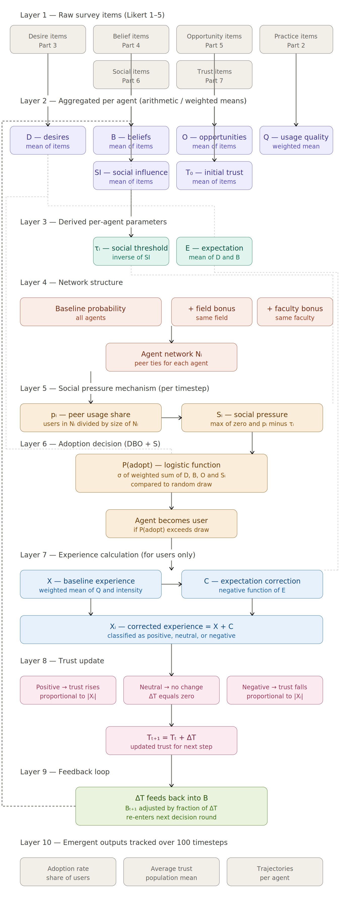

# Usage Practices and Trust in Artificial Intelligence: An Analytical Sociology Approach

This repository contains the R code used for the agent-based modelling (ABM) simulation developed for the research project "*Usage Practices and Trust in Artificial Intelligence: An Analytical Sociology Approach*". The code integrates empirical survey data with a mechanism-based simulation framework grounded in Hedström's DBO theory of action.

The preprint accompanying this code is available on [ResearchGate](https://www.researchgate.net/publication/404197729_Usage_Practices_and_Trust_in_Artificial_Intelligence_an_Analytical_Sociology_Approach).
If you use this code, please cite the paper.

## Research Aim

The study investigates the social mechanisms that drive the diffusion of large language model (LLM) usage and the formation of trust in these tools within the student population. Building on the conceptualisation of artificial intelligence (AI) as a sociotechnical system, the research moves beyond treating AI merely as a technical artefact and focuses on the reciprocal relationship between students and LLMs in the educational context.

The main objective is to explain why students begin using AI tools, how this experience alters their trust in AI, and to derive theoretically informed and empirically grounded interpretations of behavioural patterns. More specifically, the research examines:

- The role of individual desires, beliefs, and opportunities (DBO components) in the adoption of LLMs.

- The impact of social mechanisms, namely imitation and normative pressure, on the diffusion of LLM usage through student networks.

- The relationship between the quality of LLM usage and the dynamics of trust in AI, including feedback loops between experience and trust.

- The conditions under which trust develops, stagnates, or declines among different types of users.

The overarching hypothesis is that the formation and diffusion of AI tool usage and trust in them are the result of the interaction between individual DBO components, usage practices, and social influences, jointly constructed as mechanisms that shape both usage and trust.

## Methodological Procedure

The research combines survey research with agent-based modelling (ABM) within the framework of analytical sociology.

- **Survey.** A non-probabilistic sample of Croatian university students was collected using a structured questionnaire based on DBO theory. After data cleaning, the final analytical sample consisted of 309 respondents. The instrument was organised into seven sections covering sociodemographic data, usage practices, desires, beliefs, opportunities, social influences, and trust. Items were primarily measured on a 5-point Likert scale. Content validity was ensured by drawing on the Technology Acceptance Model and its extensions, research on trust in automated systems, and theories of social norms and diffusion of innovations. A factor analysis yielded six theoretically meaningful factors corresponding to the DBO model.

- **Agent-based modelling.** The empirical survey data were used to initialise the ABM simulation. Each respondent was represented as an agent with individual DBO scores, usage quality, initial trust, and a derived social threshold. Since actual peer connections could not be reconstructed from the survey, the network structure was generated using a baseline probability of connection complemented by additional bonuses for agents sharing the same scientific field or faculty. The simulation integrates mechanisms of social pressure, logistic adoption probability, expectation-corrected experience, trust change, and a trust–beliefs feedback loop. It was run over 100 timesteps, allowing for systematic exploration of causal pathways linking micro-level behaviour and macro-level social outcomes.

## Description of the R Scripts

The repository contains five R scripts that jointly implement the simulation. They are numbered according to the order in which they should be sourced.

- `0_functions_for_ABM_simulation.R`. Contains all helper functions used throughout the simulation. This includes functions for calculating individual social thresholds, social pressure, adoption probability (logistic function combining DBO components and social pressure), the expectation-correction mechanism, experience classification (positive, neutral, negative), changes in trust, and the trust–beliefs feedback loop. Centralising these functions keeps the main simulation loop clean and allows the mechanisms to be modified or extended independently.

- `1_defining_agents_and_network_connections.R`. Initialises the population of agents using the empirical survey data. Each agent is assigned individual values for desires, beliefs, opportunities, usage quality, intensity of use, social influence perception, and initial trust. The script also constructs the network structure among agents based on the baseline probability of tie formation plus additional probability bonuses for shared scientific field and shared faculty.

- `2_decision_making_and_DBO_+_S_principle.R`. Implements the core decision-making logic through which agents evaluate whether to adopt LLM usage. It combines the DBO components with the social (S) component - social pressure derived from the proportion of peers using LLMs relative to the agent's individual threshold. The script operationalises the DBO + S principle as a logistic function that returns each agent's probability of adoption at a given timestep.

- `3_trust_feedback.R`. Handles the dynamics of trust within the simulation. For each user at each timestep, the script calculates the baseline experience factor (combining usage quality and intensity), applies the expectation correction, classifies the experience type, and updates the agent's trust accordingly. It also implements the feedback mechanism through which changes in trust gradually influence agents' beliefs about AI, capturing the broader assumption that usage experiences shape perceptions of the technology's usefulness and reliability.

- `4_main_simulation_loop.R`. The main execution script that runs the ABM over 100 timesteps. At each timestep, it updates social pressures, runs the adoption decision for non-users, updates trust and beliefs for users, and records the state of the simulation (number of users, average trust, individual trajectories). The output of this script provides the data used for the subsequent analysis of diffusion dynamics and trust development.

## Final Notes and Licence

The scientific paper associated with this repository is currently under peer review in a scientific journal. I hope that this code will be useful to other researchers conducting similar studies - particularly those working at the intersection of analytical sociology, agent-based modelling, and research on artificial intelligence in education. The functions and procedures developed here are intended to be adaptable, and I would be glad if they could serve as a starting point or a helpful reference for future work on usage practices, trust dynamics, or the diffusion of sociotechnical innovations.

**Licence**

This project is licensed under the MIT License. You are free to use, modify, and distribute the code, provided that appropriate credit is given. If you use this code or adapt it for your own research, please acknowledge the author and - once published - cite the associated scientific paper.

Author: **Alen Husnjak**

Affiliation: **Faculty of Croatian Studies, University of Zagreb**

Contact: ahusnjak0810@gmail.com, ahusnjak@fhs.hr
